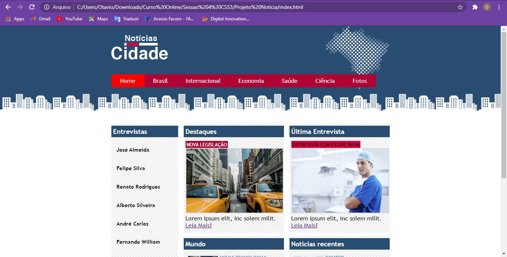
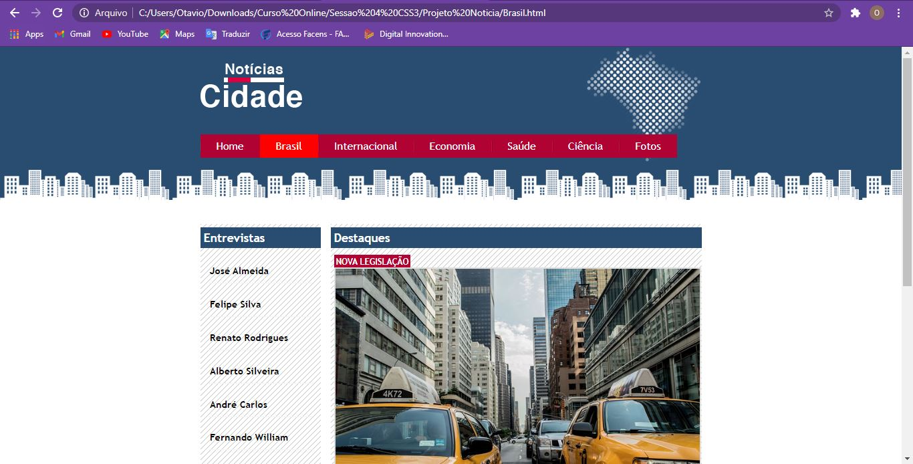
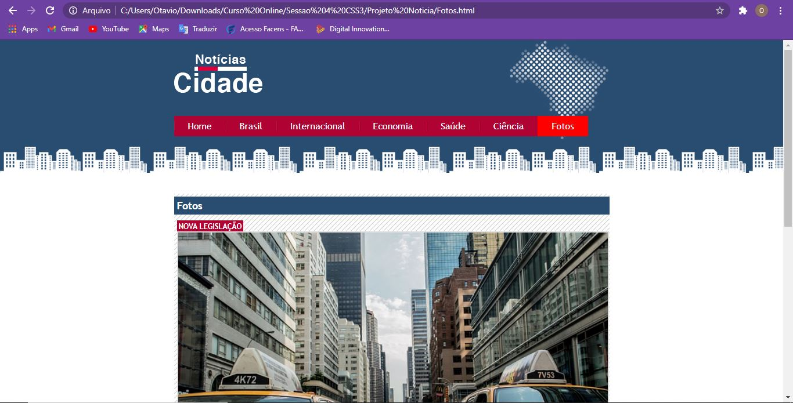

<h1 align="center">Projeto Jornal Noticias</h1>

<h2>Sobre</h2>

Neste projeto utilizei Sublime Text 3 e HTML5 com CSS3 para desenvolvimento do projeto. 

Eu busquei utilizar diferentes tamanhos de layouts:

<ul>
  <li><i>HOME</i> possui 3 divisões</li>
  <li><i>Brasil</i> possui 2 divisões</li>
   <li><i>Fotos</i> possui 1 divisão</li>
</ul>

<h2>ScreenShots</h2>

<h3>Página HOME</h3>

 3 Divisões de Layouts

<h3>Página Brasil</h3>

 2 Divisões de Layouts

<h3>Página Fotos</h3>

 1 Divisão de Layouts

